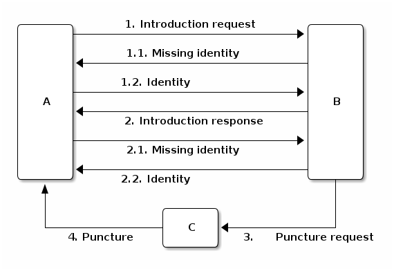

***************
System Overview
***************

Overlay
=======

The design of Dispersy is modular and extensible and lets applications define their own overlay types for specific
goals. In Dispersy all nodes communicate in one or more overlays which are called communities. An overlay is an
additional network built on top of an existing one, most commonly the Internet. By defining a community, an application
can determine which messages are going to be used, and which need to be synchronized. The body of a message is
application specific, but its headers are added by Dispersy and can contain if and to whom this message needs to be
synchronized, the id and or signature of the creator, etc.

After defining a community type, a peer needs to instantiate it. Instantiating a community requires a peer to generate
an cryptographic identifier for it. This identifier has to be known to all peers who attempt to join this instance.
Dispersy communities are completely separated from each other, through including the identifier of the overlay in
the messages. After joining a community, peers synchronize by advertising their locally available messages using a
Bloom filter.

Peer Selection
==============

Dispersy maintains a list of peers for each overlay, this list contains peers which are deemed to be connectable.
Initially, the peer list is empty, requiring a peer to initiate the peer discovery algorithm, i.e. bootstrap.
For this it uses trackers, which must not be behind a NAT-firewall. Trackers maintain lists of peers for several
overlays, and return these upon request. After a peer has populated its peer list with initial peers, it can use those
to discover others and selects a random peer to perform a synchronization step with.

In order to create a less predictable, more robust node selection algorithm a Dispersy node will divide his candidate
list into three categories:

* Trusted nodes;
* Nodes we have successfully contacted in the past;
* Nodes who have contacted us in the past; either through
    * Nodes that have sent an introduction-request; or
    * Nodes that have been introduced.

The node that is chosen for the next synchronization step is based on the probability of the different groups.
After the group is chosen, Dispersy chooses the oldest node from that group to make sure the NAT-firewall timeout
does not expire.

Trusted Nodes
-------------

Trusted nodes only consists of the tracker nodes. The tracker nodes have a probability of 1% to be selected.
This is to not overload the tracker nodes, but still keep connecting to them to clear unwanted nodes. Contacting a
trusted node will completely reset the candidate list, thereby removing any attacker nodes which
could be present.

Nodes we have successfully contacted in the past
------------------------------------------------

This group contains nodes that have responded to our introduction-request message. This group has a probability of 49.5%
to be selected.

Nodes who have contacted us in the past
---------------------------------------

This group has two subgroups. One group contains nodes that have sent us introduction-request messages and the other group
contains nodes that have been introduced to us by nodes we have successfully connected to in the past. Both of these groups
have a probability of 24.75% to be selected. Both these groups contains nodes that might possible be malicious.
The probability approach to picking the new node to communicate with is to make sure that even is this group becomes
bigger the number of nodes chosen from this group stays the same.

Peer Discovery
==============

.. image:: images/walk.png

There are four phases in discovering a new peer:

1. peer A chooses a peer B from its neighbourhood and it sends to peer B an introduction-request;
2. peer B chooses a peer C from its neighbourhood and sends peer A an introduction-response containing the address
   of peer C;
3. peer B sends to peer C a puncture-request containing the address of peer A;
4. peer C sends peer A a puncture message to puncture a hole in its own NAT.

These four phases constitute a step, and multiple steps constitute a walk. By walking, each peer discovers a set of
known peers which we define as its neighbourhood.

NAT traversal
-------------

We integrate in Dispersy a NAT traversal technique able to puncture 77% of NAT firewalls.
Not puncturing these firewalls would prevent up to 64% of peers from receiving any synchronization requests.

IP addresses and member identities
----------------------------------

In Dispersy, each peer needs to be able to verify the identities of other peers because we use a right management
mechanism. According to our right management mechanism, each peer has different access rights based on the history of
rights granted and revoked. To this end, we use public/private key pairs to allow peers to cryptographically identify
themselves. The public/private key pair of a peer represents a single Member instance which signs or verifies the
messages created by the peer itself or other peers, respectively. Ideally, we want to assign one IP address to each
member, and have this mapping be the same for every peer in the system. However, an IP address may change between
successive sessions or some peers may assign the same IP address to a Member (i.e. someone behind a symmetric NAT
uses different ports for communication with other peers). For those reasons, besides a Member
(i.e. the cryptographic key) we use an additional instance, named a Candidate which is a temporary pointer to the
current IP address of the corresponding peer. In order to provide a mapping between Members and Candidates, we create
for every Candidate a list of Member instances seen at this address. In other words, once having found a Member at a
specific IP address, we associate this member with the corresponding Candidate.

Candidate categories
--------------------

Each candidate holds a list of timestamps to compare to other candidates and place them into different categories.

We define *walk difference*, *stumble difference*, and *intro difference* as follows according to the peer discovery diagram:

    * Peer A computes the walk difference of peer B by taking the difference between the current time and receiving an
      introduction-response to an introduction-request from peer B.

    * Peer B computes the stumble difference of peer A by
      taking the difference between the current time and receiving an introduction-request from peer A.

    * Peer A computes the intro difference of peer C by taking the difference between the current time and receiving an
      introduction-response introducing peer C.

Using the computed time differences a peer assigns all other peers in one of the four categories:

1. **walk** when its walk difference is less or equal to the walk lifetime,
2. **stumble** when it is not a walk-Candidate and its stumble difference is less or
   equal to the stumble lifetime,
3. **intro** when it is neither a walk or a stumble-Candidate, and its intro difference
   is less or equal to the intro lifetime, and
4. **none** when it does not fulfil the criteria for its assignment to one of the
   previously mentioned categories.

We set both the walk lifetime and the stumble lifetime equal to 57.5 seconds because most NAT boxes close a punctured
'hole' 60 seconds after receiving the last packet. Moreover, we set the intro lifetime equal to 27.5 seconds because
most NAT boxes close a punctured `hole' after 30 seconds when no packets are received through it.

(Un)verified candidates
-----------------------

The Dispersy code provides two main methods to obtain available Candidate instances: the dispersy_yield_candidates
method returns an iterator with all walk, stumble, and intro-Candidate instances, in a randomised order.
Note that intro-Candidates are unverified, i.e. we have only heard about their existence, but did not actually have
any contact with them ourselves. The dispersy_yield_verified_candidates method returns an iterator with all walk and
stumble-Candidate instances, in a randomised order. We call these Candidates verified because we have received a
message from them at most 57.5 seconds ago (i.e. the walk and stumble lifetime). This means that, unless the peer went
offine in the mean time, the peer is still there and the NAT has, most likely, not closed yet. Note that there
are NATs that close within 57.5 seconds, those will not be reachable. Because of this, communicating with verified
candidates is often better than using unverified candidates.

Candidates we can walk towards
------------------------------

A peer is only allowed to walk towards a Candidate when the Candidate is eligible for a walk namely, it meets the two
criteria described below:

1. the category is either walk, stumble, or intro
2. the last time that this peer walked to this specific candidate, occurred at least eligible delay second ago.

We have chosen 27.5 seconds for the eligible delay, with the exception of bootstrap candidates which require a 57.5
seconds of eligible delay. As a result, the bootstrap peers are not contacted to frequently. This feature was initially
introduced to reduce the numbers of walks towards trackers in overlays with few peers.

Who to walk to
--------------

In phase 1 of the walk, peer A chooses a known peer B from its neighbourhood and sends it an introduction-request. The
dispersy_get_walk_candidate method chooses peer B and returns a Candidate instance pointing to it. If there are no
available eligible candidates, this method returns None. The choice of a Candidate to walk determines the size of the
neighbourhood of peer A. Based on its walks, peer A is able to know at most 11 Candidates because according to our
design, a peer takes one step every 5 seconds. As a result in a walk lifetime window of 57.5 seconds, it can take at
most 11 steps. Nevertheless, other peers may chose to walk to peer A. Hence, the incoming walks to peer A, that occurred
within the stumble lifetime window, increase the size of its neighbourhood accordingly. Assuming that there is at least
one eligible Candidate in every category, the selection strategy can be simplified in the following rules. Peer A
chooses with probability:

* 49.75% to revisit the oldest eligible walk-Candidate
* 24.825% to visit the oldest eligible stumble-Candidate
* 24.825% to visit the oldest eligible intro-Candidate
* 0.5% to visit a random eligible Candidate from the predefined list of bootstrap candidates

If one category is empty, the probabilities of choosing a peer from this category becomes 0.

Malicious peers can easily pollute our neighbourhood by walking towards a peer from multiple distinct addresses and
adding an arbitrary number of stumble-Candidates to its neighbourhood. To avoid such a neighbourhood pollution, we
assume that a successfully visited peer is safe. Hence, half of the time we revisit such a peer
(i.e. from the walk category) while the remaining 50% is evenly spread between the intro category and the risky
stumble category. Method dispersy_get_walk_candidate implements this design.

Who to introduce
----------------

In phase 2 of the walk, peer B chooses a known peer C from its neighbourhood and introduces it to peer A. The
dispersy_get_introduce_candidate method chooses peer C from the verified available candidates and returns
it, or, when no candidates are available, it returns None. Using dispersy_get_introduce_candidate returns a verified
candidate in semi round robin fashion. To this end each Community maintains two dynamic iterators _walked_candidates and
_stumbled_candidates which iterate over all walk-Candidates and stumble-Candidates in round-robin, respectively.

The selection process of a Candidate then becomes:
1. choose either the walk-Candidate or stumble-Candidate iterator
2. select the next Candidate in the iterator if it is not excluded, otherwise go back to step 1.

Candidate exclusion
-------------------

Peer B can not introduce peer C to A when:

* C and A are the same Candidate
* C and A are both behind a NAT and they are not within the same LAN

Duplicate candidates
--------------------

It is possible that peer B introduces an already known peer to peer A. We could have excluded the known peers by having
peer A sending a list of known peers that peer B can exclude. However, we decided not to do this because:

1. it would increase the size of the introduction-request
2. it would give peer B information about peer A
3. the larger the overlay, the smaller the chance that peer B will introduce a peer that peer A already knows

LAN and WAN address
-------------------

In phase 2 of the walk, peer B determines the LAN and WAN address of peer A by using the UDP header (i.e. the sock_addr)
of the incoming introduction-request combined with the WAN and LAN address as reported by A. We implement this in method
estimate_lan_and_wan_addresses using a simple rule: when peer B sees that the corresponding message originates
from its LAN, it decides that peer A's LAN address is the sock_addr. If the message originates outside its LAN, then
peer A's WAN address is the sock_addr.

Dispersy determines whether an address originates within its own LAN or not by checking if it corresponds with one of
its local interfaces, with regards to its netmask. We do this using the _get_interface_addresses method and the
Interface instances that it returns. Peer B uses the result of this estimation to update the lan_address and wan_address
properties of the Candidate instance pointing to peer A. These values are also added to the introduction-response,
allowing peer A to assess its own WAN address.

WAN address voting
------------------

In phase 2 of the walk, peer A receives an introduction-response containing the LAN and WAN address that peer B believes
it has. This dial back allows peer A to determine how other peers perceive it, and thereby whether a NAT is affecting
its address. When peer A is not affected by a NAT the voting will provide it with its own address. This is useful when
peer A and B are both within the same LAN while peer C is not. In this case peer A will send an introduction-request
(which includes the WAN address determined by voting) to peer B, peer B will inform peer C of both A's LAN
(as determined by the UDP header) and WAN address (as reported by A), allowing peer C to determine that peer A is not
within its LAN address, hence it will use peer A's reported WAN address to puncture its own NAT. When a NAT affects peer
A the voting will provide information about the type of NAT, i.e. the connection type, that it is behind, as described
below. This connection type effects who a peer introduces when receiving an introduction-request. Most of the magic
happens in the wan_address_vote method and goes roughly as follows:

1. remove whatever B voted for before,
2. if the address is valid and B is outside our LAN then add the vote
3. select the new address as our WAN address if it has equal or more votes than our current WAN address. Note that
   changing our WAN address also makes us re-evaluate our LAN address;
4. determine our connection type based on the following rules:
        * **public**, when all votes have been for the same address and our LAN and WAN addresses are the same
        * **symmetric-NAT**, when we have votes for more than one different addresses
        * **unknown**, in all other cases

Cleanup old voting data
-----------------------

To allow for changes in the connectivity, i.e. when running on a roaming machine that changes IP addresses periodically,
we must remove older votes, by calling the wan_address_unvote method5, that may no longer apply. Dispersy does this by
periodically (every five minutes) checking for obsolete Candidate instances. Where we consider a Candidate to be
obsolete when the last walk, stumble, or intro was more than lifetime seconds ago, where lifetime is three minutes.
This means that it can take anywhere between five and eight minutes before removing old votes.

Transferring the public key
---------------------------

The  messages introduction-request and introduction-response used to discover new nodes do not contain the public key
of the sender, we transfer this key using a missing-identity request and a identity message response.
Luckily this is only needed for public keys that we do not yet have. So the first time a node connects the
interaction between the nodes goes like:

Bloom filter
============

In Dispersy, nodes synchronize bundles by advertising their locally available bundles using Bloomfilters.
The Bloomfilters contain the bundles which a sending node has received previously, allowing the receiving node to check
for missing bundles. Included in the introduction-request messages is a Bloom filter which advertises the locally
available messages of a peer. We only include a subset of all messages locally available in the Bloom filter in order to
keep the false positive rate low. Moreover, as Dispersy is based on UDP we limit the size of the message which
includes the Bloom filter to the maximum transmission unit (MTU) of the link in order to avoid fragmentation.
IP fragmentation is caused by a router in the path having a lower MTU than the packet size. A typical MTU size on the
Internet is 1500 bytes, for 802.11 it is 2304 bytes.

We define message synchronization as creating consistency in a network of peers by resolving differences in messages
received between two peers at a time. Peers regularly request missing messages by advertising their locally available
messages using a Bloom filter. A Bloom filter is a compact hash-representation which allows for membership testing.
Upon receiving such a request, a peer uses the Bloom filter to test if it has messages available the other has not.

Our synchronization technique consists of five steps:

1. Select a node from our candidate list
2. Select a range of bundles for synchronization
3. Create a Bloomfilter by hashing the selected bundles
4. Send the Bloomfilter to the selected node
5. Pause for a fixed interval and goto step 1